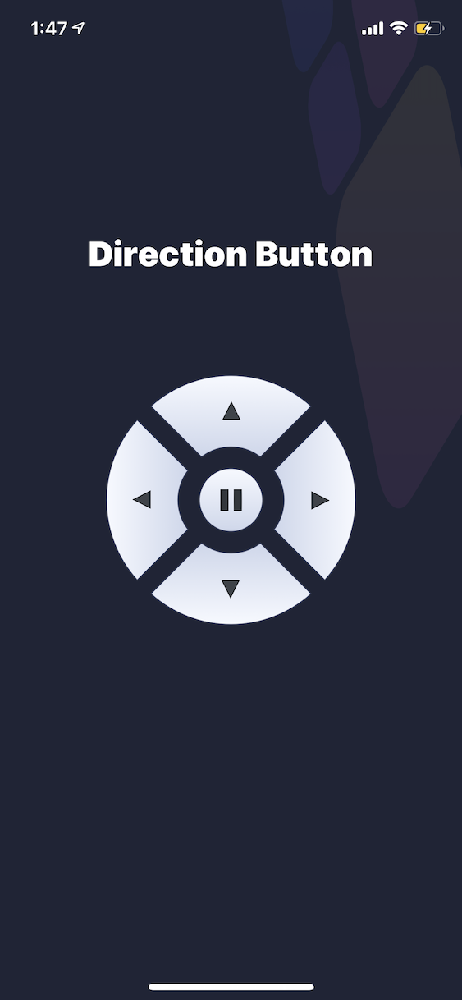

# DirectionButton 

()

## Contents

- [DirectionButton](#directionbutton)
  - [Contents](#contents)
  - [Requirements](#requirements)
  - [Communication](#communication)
  - [Installation](#installation)
    - [CocoaPods](#cocoapods)
    - [Carthage](#carthage)
    - [Manually](#manually)
  - [Usage](#usage)
    - [Quick Start](#quick-start)
  - [Credits](#credits)
  - [License](#license)

## Requirements

- iOS 10.0+
- Xcode 9.0+
- Swift 4.2+

## Communication

- If you **found a bug**, open an issue.
- If you **have a feature request**, open an issue.
- If you **want to contribute**, submit a pull request.


## Installation

### CocoaPods

[CocoaPods](http://cocoapods.org) is a dependency manager for Cocoa projects. You can install it with the following command:

```bash
$ gem install cocoapods
```

To integrate SnapKit into your Xcode project using CocoaPods, specify it in your `Podfile`:

```ruby
source 'https://github.com/CocoaPods/Specs.git'
platform :ios, '10.0'
use_frameworks!

target '<Your Target Name>' do
    pod 'DirectionButton', '~> 0.0.9'
end
```

Then, run the following command:

```bash
$ pod install
```

### Carthage

[Carthage](https://github.com/Carthage/Carthage) is a decentralized dependency manager that builds your dependencies and provides you with binary frameworks.

You can install Carthage with [Homebrew](http://brew.sh/) using the following command:

```bash
$ brew update
$ brew install carthage
```

To integrate SnapKit into your Xcode project using Carthage, specify it in your `Cartfile`:

```ogdl
github "DirectionButton/DirectionButton" ~> 0.0.9
```

Run `carthage update` to build the framework and drag the built `SnapKit.framework` into your Xcode project.

### Manually

If you prefer not to use either of the aforementioned dependency managers, you can integrate DirectionButton into your project manually.

---

## Usage

### Quick Start

```swift
class ViewController: UIViewController {

    override func viewDidLoad() {
        super.viewDidLoad()
        
        let btn = DirectionButton.init(frame: CGRect.init(x: 100, y: 100, width: 200, height: 200))
        btn.tapDelegate = self
        
        view.addSubview(btn)
    }


}

extension ViewController: DirectionButtonDelegate{
    func didTapDirectionButton(direction: ButtonDirection) {
        // Tap DirectionButton Action
    }
    
    func didTapCenterButton() {
        // Tap CenterButton Action
        
    }
}

```


## Credits

- zhouqitian ([@zhouqitian])
- Many other contributors

## License

DirectionButton is released under the MIT license. See LICENSE for details.
